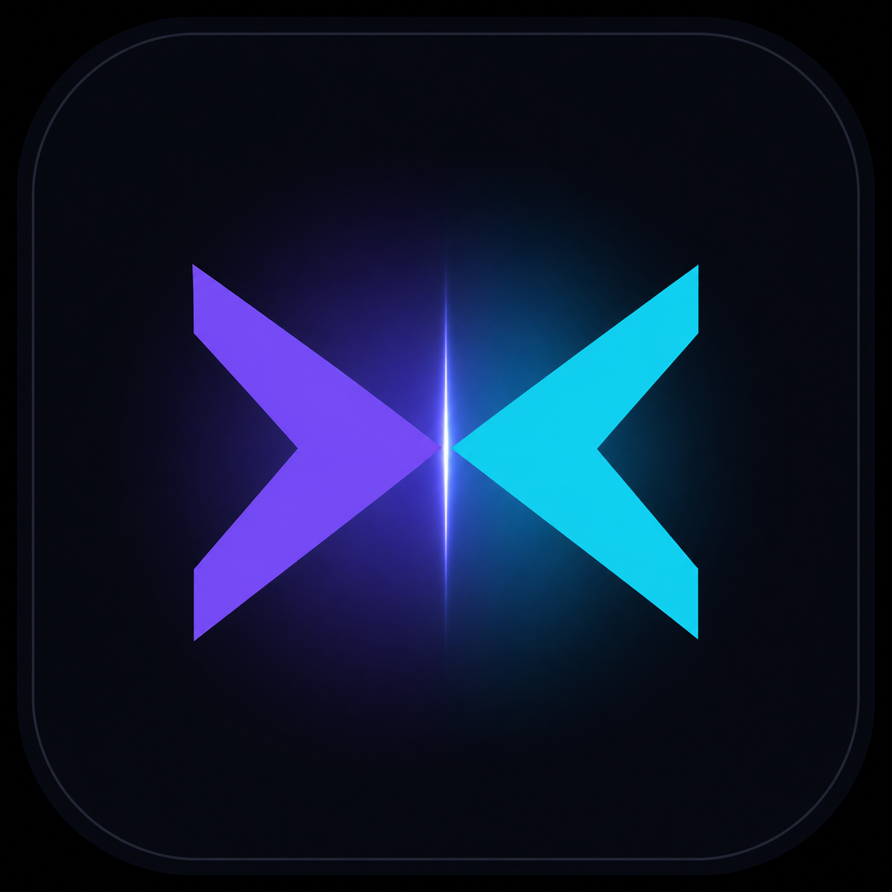

# vlarena

<p align="center">
  
</p>

<p align="center">
  <strong>A desktop LLM battle arena.</strong><br/>
  One prompt → several frontier models answering side by side, names hidden until you judge.
  Your votes move a local Elo leaderboard, so the ranking reflects <em>your</em> taste, not the crowd's.
</p>

<p align="center">
  Inspired by arena.ai's Battle Mode — rebuilt as a native desktop app: offline-first, private, ~8 MB installer.
</p>

---

## Features

- **Battle Mode** — send a prompt to 2–4 models at once. Lanes stay anonymous (`Model A/B/C/D`) until you vote.
- **Blind voting** — 👑 crown a lane, call it a tie, or mark both bad. Ratings update with pairwise Elo (K=24), per category: `overall`, `coding`, `creative`, `reasoning`, `math`.
- **Live leaderboard** — Elo with 95 % confidence bands, win rate, per-category tabs, trend sparklines, and a head-to-head win-probability calculator.
- **Real-time metrics** — time-to-first-token, decode speed (tok/s), token count and elapsed time per lane, updated while streaming.
- **History & search** — every battle is stored with the full transcript; full-text search over prompts *and* answers.
- **Offline simulator** — ships with a persona-based generator that streams plausible answers per model (verbosity, structure, code bias, tone, latency, jitter) so the app is fully usable with **zero keys and zero network**.
- **Bring your own keys** — switch to `live` mode and route any model to OpenAI-compatible endpoints, Anthropic, OpenRouter or a local server (Ollama/vLLM/LM Studio). Keys never leave your machine.
- **Command palette** (`⌘K`) — every action, battle and model reachable by fuzzy search.
- **Themes** — dark / light / system, plus a reduced-motion mode.
- **Markdown that survives streaming** — hand-rolled renderer with syntax highlighting that tolerates half-written fences and partial bold markers.

## Quick start

```bash
npm install
npm run dev            # web app on http://localhost:1420 (also what the webview loads)
```

Desktop shell (requires Rust stable):

```bash
npm run icons          # once per clone: generate .icns/.ico/sized .png from app-icon.png
npm run tauri dev      # native window with hot reload
npm run tauri build    # .dmg · .msi/.exe · .deb/.rpm/.AppImage
```

Linux build deps: `libwebkit2gtk-4.1-dev libssl-dev libgtk-3-dev libayatana-appindicator3-dev librsvg2-dev`.
Windows/macOS need nothing beyond Rust; CI builds all targets on tags.

## Providers

| Provider            | Wire protocol      | Default base URL                 |
| ------------------- | ------------------ | -------------------------------- |
| Simulator (offline) | — (local personas) | —                                |
| OpenAI-compatible   | `/chat/completions`| `https://api.openai.com/v1`      |
| Anthropic           | `/v1/messages`     | `https://api.anthropic.com`      |
| OpenRouter          | `/chat/completions`| `https://openrouter.ai/api/v1`   |
| Custom / local      | `/chat/completions`| `http://127.0.0.1:11434/v1`      |

Routing is per-model (Settings → Routing): pick the provider and the exact wire id
(e.g. `anthropic/claude-opus-4.6` on OpenRouter). In `live` mode, requests go through
Tauri's HTTP plugin on desktop — provider CORS policies don't apply.

## Keyboard

| Keys            | Action                          |
| --------------- | ------------------------------- |
| `⌘/Ctrl K`      | Command palette                 |
| `⌘/Ctrl N`      | New battle                      |
| `⌘/Ctrl ↵`      | Send prompt (plain `↵` also)    |
| `⌘/Ctrl B`      | Toggle sidebar                  |
| `⌘/Ctrl ,`      | Settings                        |
| `⌘/Ctrl R`      | Reveal models                   |
| `1…4`           | Crown lane best                 |
| `T` / `B`       | Tie / both bad                  |
| `Esc`           | Stop streaming / close overlays |

## How ratings work

Each round is reduced to pairwise results — the crowned lane beats every other lane, everything else draws.
Deltas use the standard Elo update against the expected score, normalised by lane count, so a 4-way battle
can't swing four times harder than a duel. The confidence band is `1.96 · σ / √votes`.

Seed ratings in `src/lib/models.ts` are **illustrative placeholders** (the app labels itself `SIM` while using
them) and are replaced by your own history as you vote. `Settings → Data → Reset` restores them.

## Architecture

```
src/
  lib/        domain types, Elo math, model catalog, simulator, providers, export
  store/      app store (reducer + persistence) and the streaming lane store
  components/ views, panes, palette, markdown renderer, icon set
src-tauri/    Rust shell: window config, capabilities, store + http plugins
.github/      desktop CI: mac arm64/x64, windows, linux + web typecheck
```

Streaming deliberately bypasses React's reducer: tokens land in `store/lanes.ts`
(an external store read via `useSyncExternalStore`), batched per animation frame, and are
committed to the persisted battle only when a round finishes. The reducer owns durable data.

## CI

`ci/desktop.yml` builds the web bundle plus macOS (arm64/x64), Windows and Linux installers
on every tag (draft release) and on PRs (artifacts). It lives outside `.github/workflows/`
because some automation tokens can't push workflow files; enable it with:

```bash
mkdir -p .github/workflows && cp ci/desktop.yml .github/workflows/
```

## Privacy

No telemetry, no accounts, no backend. Battles, ratings and API keys are stored locally
(`tauri-plugin-store` on desktop, `localStorage` in the browser). Simulated mode makes zero
network requests.

## Roadmap

- [ ] Shareable battle links (export → gist/import)
- [ ] Vision lanes (attach screenshots)
- [ ] Bradley-Terry fitting over raw ballots instead of incremental Elo
- [ ] Updater plugin + signed releases
- [ ] Mobile (iOS/Android) via the same Tauri v2 codebase

## License

MIT — see [LICENSE](LICENSE). Not affiliated with arena.ai. Model names, prices and seed
ratings are sample catalog data for the offline simulator.
